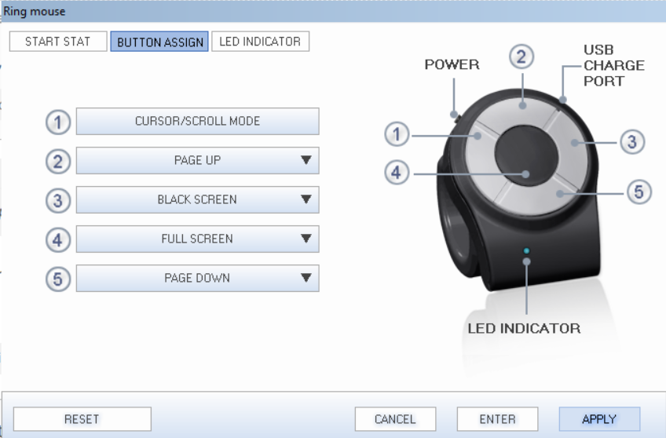

# GlassMessagingPython
The socket server to communicator with HoloLens2 in the Unity App


## Installation
- make sure python3 is installed (tested on Win11)
- install [pynput](https://pypi.org/project/pynput/)
- install [python-telegram-bot --pre](https://github.com/python-telegram-bot/python-telegram-bot)
- install [pandas](https://pypi.org/project/pandas/)
- install [python-Levenshtein](https://pypi.org/project/python-Levenshtein/)
- install [opencv-python](https://pypi.org/project/opencv-python/)
- create a file `telegram_token.json` with Telegram bot token (Note: json format must be correct)
  - ```json
    {
    "token": "XXXXX",
    "ip": "IP_ADDRESS_OF_PHONE_APP"
    }
    ```
- run `chat_communication.py` (`python chat_communication.py`)


### HoloLens app
- install the corresponding mixed reality app in [GlassMessagingUnity](../GlassMessagingUnity)
- disable SSL for recording videos (Device Portal -> System -> Preference -> SSL connection)


### Phone apps
- install Telegram and create the contact list via Telegram bot (create the Group with the contact name and Telegram bot, give the bot admin rights, and remove the real person)
- update the Telegram Group ID in `chat_data.py` (line 317, `PLATFORM_PHONE_CONVERSATION_IDS`)
- start the Telegram
- start the Android app in [NIPGlass](https://github.com/NUS-HCILab/NIPGlass/tree/poc/communicator_pilot_1.3)
- keyboard config [see](phone_keyboard_config.mp4)

## Run the application (sever)
- connect the computer (server that runs this code) and HoloLens to the same PRIVATE network (e.g., your phone's hotspot)
- identify the IP address of the computer/server
- configure the HoloLens to support the IP address of the computer/server (see [GlassMessagingUnity](../GlassMessagingUnity))

### Ring mouse
- see 


