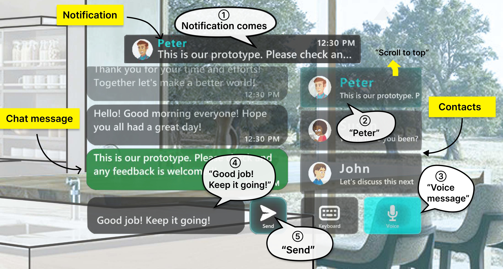

# GlassMessaging
A messaging application for smart glasses (a clone of private repos [HeadsUpCommunicator-Python](https://github.com/NUS-HCILab/HeadsUpCommunicator-Python) and [HeadsUpCommunicator-Unity](https://github.com/NUS-HCILab/HeadsUpCommunicator-Unity))


## Publications
- [GlassMessaging: Towards Ubiquitous Messaging Using OHMDs](https://doi.org/10.1145/3610931), IMWUT'23 [**[PDF]**](IMWUT2023_GlassMessaging.pdf) (camera ready)
```
@article{janaka_glassmessaging_2023,
	title = {{GlassMessaging}: {Towards} {Ubiquitous} {Messaging} {Using} {OHMDs}},
	volume = {7},
	shorttitle = {{GlassMessaging}},
	url = {https://doi.org/10.1145/3610931},
	doi = {10.1145/3610931},
	language = {en},
	number = {3},
	journal = {Proceedings of the ACM on Interactive, Mobile, Wearable and Ubiquitous Technologies},
	author = {Janaka, Nuwan and Gao, Jie and Zhu, Lin and Zhao, Shengdong and Lyu, Lan and Xu, Peisen and Nabokow, Maximilian and Wang, Silang and Ong, Yanch},
	month = sep,
	year = {2023},
}
```

- [](GlassMessaging_video.mp4)


## Contents
- This repo contains the messaging server implementation using Python ([GlassMessagingPython](GlassMessagingPython)) and UI implementation using Unity ([GlassMessagingUnity](GlassMessagingUnity))

## Requirements
- Windows 10/11 to build the Unity app
- Unity 2021.3.6f1 or higher
- Python 3.7 or higher
- See the individual folders for requirements and installations


## Contact person
- [Nuwan Janaka](https://nuwanjanaka.info/) ([In](https://www.linkedin.com/in/nuwan-janaka/))


## Project links (private access only)
- Project folder: [here](https://drive.google.com/drive/folders/1CqxksKqbWj3fFgkaM43mt13Ry99CElnU?usp=sharing)
- Documentation: [here](https://docs.google.com/document/d/1K2Rw7CJwV2W6bcwpeM6ma95P1PWovJr516z5i2-7B78/edit?usp=sharing)
- [Version info](VERSION.md)


